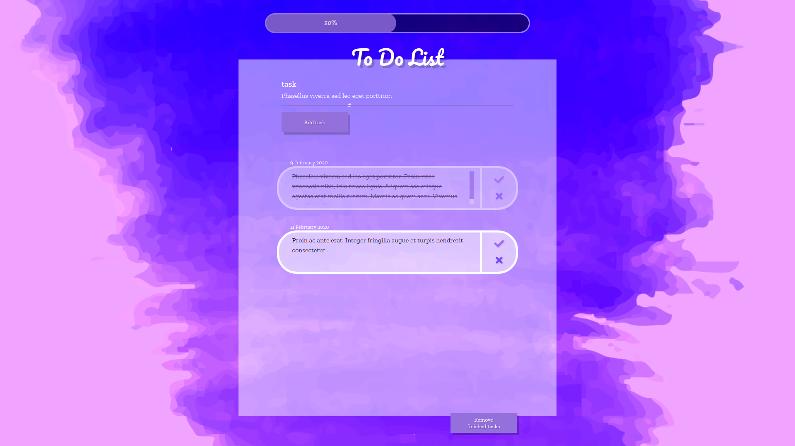

# To Do List

## Description:
A "To Do List" can be used to create a list of tasks to do. Every task has an add date. All the finished tasks can be marked as "done" by clicking a "check mark" icon. If you want to delete a task, you can use the "x" icon. Above the list there is a progress bar, which is updated with every added/deleted/finished task. If you press the button at the bottom of the list, you can remove all the tasks.

## Technologies:
- HTML5
- CSS
- Vanilla JavaScript

## Preview: 
Check the preview [HERE](https://https://cenora6.github.io/To-Do-List/)
